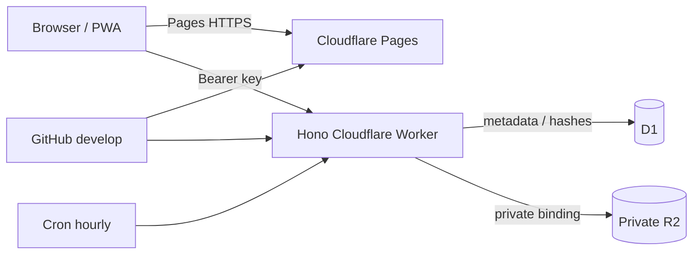

# Photo Choice

複数人で撮影した写真から、SNS等へ掲載したい写真を仲間だけで選ぶ、アカウント不要・期限付きの写真共有PWAです。暗号学的に推測困難なRoom/Access key、非公開R2、期限後の自動削除を前提にしています。

> **Production Branchは `develop` です。`main` を本番Deployに使用しません。**

## Architecture



FrontendはReact/Vite/Tailwind互換CSS/PWA、BackendはHono Worker、metadataはD1、変換済み画像はprivate R2です。API/写真はService Workerでcacheせず、offline時に古い個人写真を表示しません。

## Directory

- `src/`: Pages、Components、browser access/API logic
- `worker/`: routes、services、repositories、security/image utilities
- `shared/`: browser/Worker共通型
- `migrations/`: versioned D1 schema
- `tests/unit`, `tests/integration`, `tests/e2e`: 分離したtest layers
- `docs/design.md`: API、security、cleanup判断
- `docs/free-domain-setup.md`: 無料の`pages.dev`ホスト名による暫定公開手順と独自ドメイン移行方針

## Local development

Node.js 22.13以上とnpmを使用します。リポジトリ直下の`.node-version`は、
`package.json` の`engines`を参照しないCloudflare Pagesのbuild imageでも、
依存関係を対応済みのNode.jsでinstallするために必要です。

```bash
npm install
cp .dev.vars.example .dev.vars
npm run db:migrate:local
npm run dev:worker              # terminal 1, :8787
npm run dev                     # terminal 2, Vite proxy
```

Quality commands:

```bash
npm run check               # GitHub Actionsのquality jobと同じコミット前検証
npm run test
npm run test:unit
npm run test:integration
npx playwright install chromium # 初回だけ
npm run test:e2e
npm run lint
npm run format
npm run format:check
npm run typecheck
npm run build
```

`npm run check`はlocal D1 migration、Unit/Integration test、warningを許容しないlint、format、typecheck、Production buildを順に実行し、いずれかが失敗すると非0で終了します。E2Eはbrowser導入が必要なため、必要に応じて別途`npm run test:e2e`を実行します。

Unitはpure domain/security、Integrationはroute/service + D1/R2境界、E2Eは実ブラウザJourneyを担当します。TDDでは失敗testを先に追加し、最小実装、全test成功、refactorの順で進めます。

## Cloudflare setup

1. Cloudflare Accountを用意し、`npx wrangler login`。
2. `npx wrangler d1 create photo-voting` のIDを`wrangler.worker.toml`へ設定。
3. `npx wrangler r2 bucket create photo-voting-private`。Custom domain/public development URLを**設定しない**。
4. 手動でDBだけを更新する場合は`npm run db:migrate:remote`。通常は次の`npm run deploy`が、build、remote migration、Worker deployの順に実行する。
5. 非秘密limitはvars、将来のsecretは`npx wrangler secret put NAME --config wrangler.worker.toml`で登録する。本物を`.dev.vars.example`へ書かない。
6. `npm run deploy`でmigrationとAPI Workerをdeploy。migrationが失敗した場合はWorkerを更新しない。Cron `0 * * * *`は`wrangler.worker.toml`から反映される。API Worker用設定はWebの`wrangler.jsonc`と分離している。
7. R2 DashboardのLifecycle ruleでprefix `rooms/`、60日後deleteを設定する（アプリの最大30日 + cleanup安全margin 30日）。
8. PagesをGitHub repositoryへ接続し、Build commandを`npm run build`、outputを`dist`、**Production branchを`develop`**へ設定する。Node.jsは`.node-version`で固定されるため、Dashboardの`NODE_VERSION`で古いversionを上書きしない。PagesのProduction環境に変数名`API`、Service `photo-voting-api`のService bindingを追加する。`functions/api/[[path]].ts`が`/api/*`をsame-originでWorkerへ中継する。
9. Cloudflare WAF Rate Limitingで `/api/rooms`、認証、参加、写真、投票、AdminをIP単位で制限する。例として作成10/時、認証60/分、写真120/分を開始値とし、利用状況に合わせる。

Workers BuildsのPreview buildを使う場合、Deploy commandは`npx wrangler preview`とする。
`wrangler.jsonc`の`previews`設定が`dist`をStatic Assetsとして公開し、`/api/*`だけを
productionの`photo-voting-api` Service bindingへ中継する。そのためAPI Workerを先にdeployする。

`develop` push/mergeがProduction deploy、PRとその他branchはPages Previewです。GitHub Environmentにもproduction branch ruleとして`develop`だけを許可します。RollbackはCloudflare Deploymentsから直前versionを選び、D1は前方互換migrationを原則とします。破壊的変更はexpand/migrate/contractに分けます。

## GitHub deployment

Repository secretに`CLOUDFLARE_API_TOKEN`と`CLOUDFLARE_ACCOUNT_ID`を設定します。CIは全branch/PRを検証し、deploy jobは`develop` pushだけで実行します。Pages側Git Integrationを使う場合、二重Deployを避けるためWorkflowのdeploy stepはWorkerのみとしてください。

## Data and access security

Access/Admin keyはURL queryではなくFragmentで渡し、browserがsessionStorageへ移した後にURLから消します。D1にはSHA-256 hashだけを保存します。人が決めるpasswordではなく256-bit random secretなので高速hashでもoffline総当たりは非現実的です。Room不存在/鍵不正/期限切れは同じ404を返し、Room IDだけではmetadataも写真も取得できません。Participant keyはAdmin endpointで拒否します。

画像はclient側で長辺2560px、JPEG quality 0.85へ変換してEXIFを除去する方針です。Workerでも5 MiB、200枚、合計1 GiB、宣言MIMEとmagic bytesを検査します。HEICはMVP対象外です。R2 URLを公開せず、認証済みWorkerから`private, no-store`で配信します。

## Automatic and immediate deletion

毎時Cronは期限切れ/deleting Roomを抽出し、Roomをdeleting化、R2 prefix削除、D1 Room削除（FK cascade）の順で処理します。途中失敗は次回再実行できます。R2 60日LifecycleはCron障害時の安全網です。管理者の即時削除も同じServiceを使います。

## Troubleshooting

- `D1_ERROR no such table`: local/remote対象を確認してmigrationを再適用。
- R2 `not found`: bucket名と`PHOTOS` binding、public化されていないことを確認。
- Fragment付きURLで拒否: URLをchat clientが途中で切っていないか、期限切れでないか確認。keyをlogへ貼らない。
- PWA更新が反映されない: DevTools Applicationで更新を確認。API/写真はNetworkOnlyなのでcache削除でdata不整合を直す設計ではありません。
- PreviewでAPIへ接続できない: Preview hostnameのWorker route/CORSではなくsame-origin proxy設定を確認。
